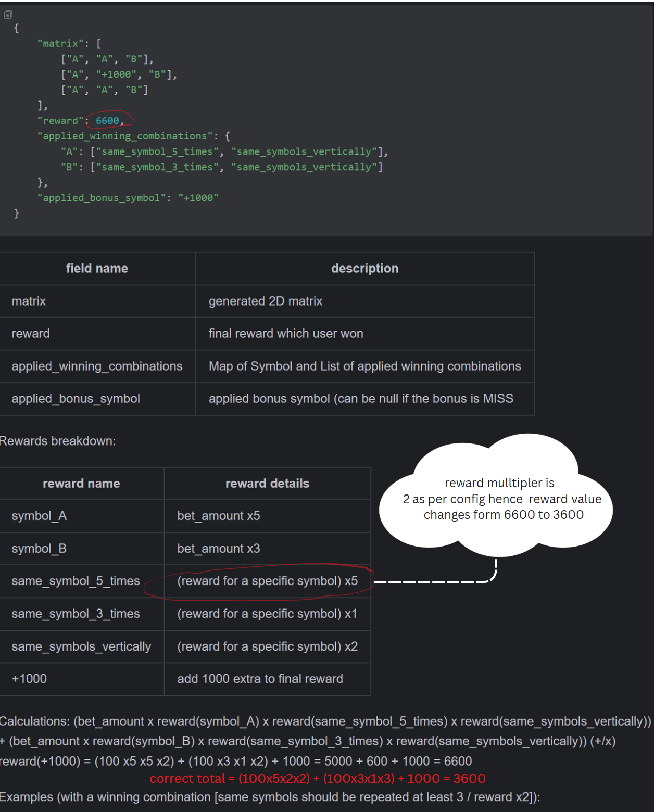

# 🎰 Scratch Game (Java 17 CLI App)

This is a command-line based scratch card game built using Java 17 and Maven. 
The game generates a matrix of symbols based on configurable probabilities and 
evaluates winning combinations along with optional bonus symbols. 

---
## ⚙️ Build Instructions

Make sure you have:
- Java 17 installed
- Maven 3.9.9 installed

### 🛠️ To build the project:

```bash
mvn clean package
```

This creates a fat JAR at:  
`target/scratch-game.jar`

---

## ▶️ Run the Game

```bash
java -jar target/scratch-game.jar --config src/test/resources/config.json --betting-amount 100
```

### 💡 Example Output

```json
{
  "matrix": [
    ["A", "A", "B"],
    ["A", "+1000", "B"],
    ["A", "A", "B"]
  ],
  "reward": 3600,  
  "applied_winning_combinations": {
    "A": ["same_symbol_5_times", "same_symbols_vertically"],
    "B": ["same_symbol_3_times", "same_symbols_vertically"]
  },
  "applied_bonus_symbol": "+1000"
}
```

**Note**: 
reward value is updated to 3600. Reason:


---
## Problem Statement
You need to build a scratch game, that will generate a matrix (for example 3x3) from 
symbols(based on probabilities for each individual cell) and based on winning combintations 
user either will win or lose.
User will place a bet with any amount which we call *betting amount* in this assignment.

#### [Please look this for problem statement in detail](assignment/problem_description)

---
## 🚀 Features

- Matrix-based scratch card generation
- Symbol probabilities and bonus logic from `config.json`
- Multiple win combination rules (e.g., same symbols, row/column/diagonal patterns)
- Bonus symbol effects (`+500`, `10x`, `MISS`, etc.)
- Clean architecture and Java 17 features
- Console output in JSON format
- Unit tests with JUnit, Mockito
- Fat/uber JAR build for easy CLI usage

---
## 🔢 Algorithms

### Matrix Generation Algorithm

* For each cell in matrix:

    * Get standard probability list for that (row, column)
    * Generate random symbol based on weights
* Choose a random position

    * Place exactly 1 bonus symbol from configured set using weighted randomness

### Win Evaluation Algorithm

* Used data-drive approach
* Created a Symbol count tracking map, cell list and stored the details in one matrix scan.
* Iterate all win rules
* For each rule:

    * Check if symbol pattern matches based on "when"
    * If match, store the matched rule
    * If multiple win rule match with the same rule **group** use the win rule having max multiplayer
* Store matched rules
* Calculated the total rewards using stored matched rules and symbol multiplier.

### Bonus Application Algorithm

* Add the bonus to the total if there is a matched win rule.
* Based on bonus symbol impact:

    * "multiply" → multiply reward
    * "extra" → add fixed bonus
    * "miss" → zero reward

## 📂 Project Structure

```
scratch-game/
├── src/
│   ├── main/java/com/scratchgame/...
│   ├── test/java/com/scratchgame/...
│   └── test/resources/config.json
├── docs/diagrams             # PlantUML + diagrams
├── pom.xml                   # Maven build file
└── README.md
```

---


## 📘 Configuration (`config.json`)

Defines:
- Symbol probabilities
- Bonus symbols
- Matrix size (rows × columns)
- Win combinations and multipliers

Bonus symbols only apply if at least one win condition is met.

---

## 🧪 Testing

```bash
mvn test
```

Includes:
- Unit tests for core logic
- Integration tests for full run
- Uses: JUnit 5, Mockito

---

## 🧩 UML & Documentation


see [Software Specification Document](./SSD.md) for document list

See [`/docs/diagrams`](docs/diagrams) for: UML Diagrams

See [`/docs/`](./docs/) for: SSD documents

---

## 📄 License

This project is for educational/demo purposes only.

---

## 👤 Author

Made with ❤️ by Dikshith Shetty
