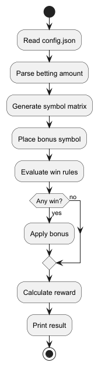
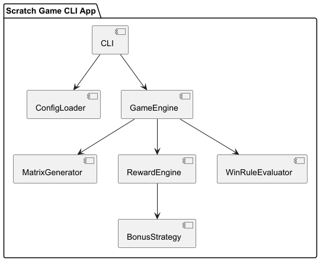
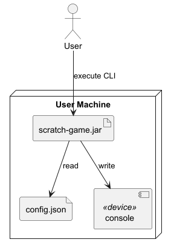
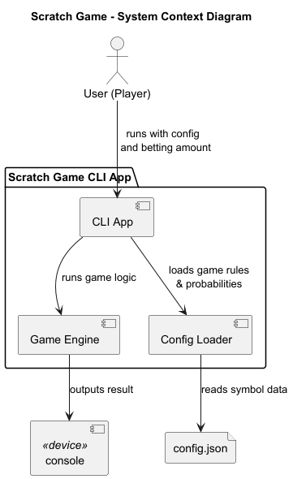

# 02. High-Level Design (HLD)

## 1. Objective

The Scratch Game CLI application simulates a scratch card game using a configuration file. It randomly generates a symbol matrix, evaluates winning conditions, applies bonus symbols if applicable, and calculates the final reward based on a betting amount.

---

## 2. Architecture Overview

This application follows a modular architecture with the following major components:

- **CLI** – Handles input arguments and output/displays results.
- **ConfigLoader** – Parses and validates the JSON configuration.
- **GameEngine** – Orchestrates the entire game flow.
- **MatrixGenerator** – Creates the matrix based on symbol probabilities.
- **RewardEngine** – Evaluates the matrix and calculates the reward.
- **BonusStrategy** – Applies any bonus logic if a win is detected.

---

## 3. Technology Stack

| Component             | Technology                        | Reason                                                     |
|-----------------------|-----------------------------------|------------------------------------------------------------|
| CLI Interface         | Java CLI                          | Lightweight, suitable for terminal-based interaction       |
| JSON Parsing          | Jackson (Databind)                | Fast and reliable JSON serialization/deserialization       |
| Core Logic            | Java 17                           | Modern language features, stable for production use        |
| Build Tool            | Maven                             | Dependency and build management                            |
| Testing               | JUnit 5, Mockito                  | Modern unit testing and Mocking framework                  |
| Code Coverage         | JaCoCo                            | Analyzes and enforces test coverage                        |
| Performance Benchmark | Java Microbenchmark Harness (JMH) | It's a toolkit for building reliable JVM micro-benchmarks. |
---

## 4. Component Responsibilities

| Component         | Responsibility                                                                |
|-------------------|-------------------------------------------------------------------------------|
| `CLI`             | Entry point, Reads config path and betting amount from user; calls GameEngine |
| `ConfigLoader`    | Parses `config.json` and maps it to in-memory Java objects                    |
| `GameEngine`      | Coordinates matrix generation, reward evaluation, and final output            |
| `MatrixGenerator` | Fills the matrix with standard symbols based on per-cell probabilities        |
| `RewardEngine`    | Checks win rules; computes reward; invokes bonus strategy if needed           |
| `BonusStrategy`   | Modifies the reward based on bonus symbol impact (e.g., multiply, fixed add)  |

---

## 5. Design Flow

---

## 6. Component Interaction Diagram

---

## 7. Deployment Diagram

---

## 8. System Context Diagram

---

## 9. Assumptions

- `config.json` is always valid 
- Matrix can be non-square (n×m)
- Bonus symbols are placed exactly once, at a random cell
- Symbol selection is pseudo-random based on probability
- Betting amount is fractional and handled using `BigDecimal`
- Output is printed in JSON-like format

---

## 10. Design Decisions

- We used modular service classes to allow extensibility
- Each module has single responsibility
- Separated standard symbol and bonus symbol logic
- Config-driven architecture allows rule and symbol extension without code change
- Tests and coverage are integrated using Maven and JaCoCo

---

## 11. External Design Links

- 🔹 [Configuration Schema](./config_schema.json)
- 🔹 [Output Format](./output_format.md)

---

[Previous](./01_requirements_analysis.md) | [Next](./03_low_level_design.md)
