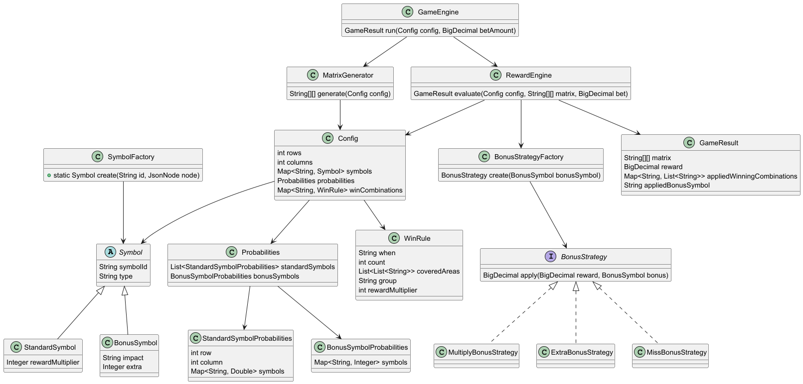
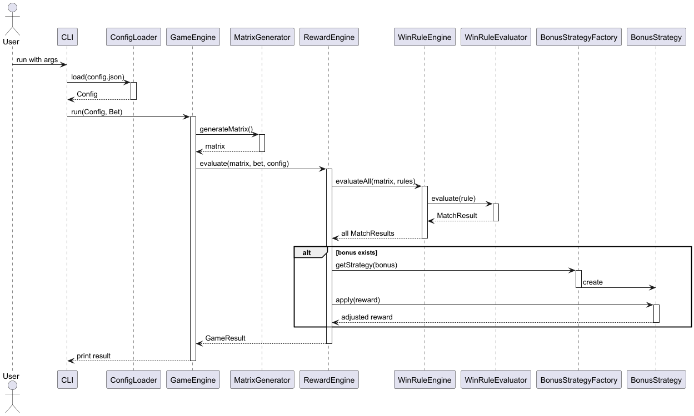

# 03. Low-Level Design (LLD)

## 1. Objective

This document provides a detailed design for each module, class, and data model in the Scratch Game application. It includes mappings of configuration fields to Java classes, method responsibilities, control flow, and parsing strategies.

---

## 2. Class Responsibilities & Design

### 2.1 CLI 

* Parses command-line args for config path and betting amount (BigDecimal)
* Invokes ConfigLoader and GameEngine

### 2.2 ConfigLoader

* Reads `config.json` using Jackson
* Maps configuration into `Config` POJO

### 2.2 Config (Root Object)

```java
class Config {
    int rows;
    int columns;
    Map<String, Symbol> symbols;
    Probabilities probabilities;
    Map<String, WinRule> winCombinations;
}
```

### 2.2.1 Symbol

```java
class Symbol {
    String type; // "standard" or "bonus"
    Integer rewardMultiplier;
    Integer extra;
    String impact; // for bonus symbols
}
```

### 2.2.2 Probabilities

```java
class Probabilities {
    List<StandardSymbolProbabilities> standardSymbols;
    BonusSymbolProbabilities bonusSymbols;
}
```

### 2.2.3 StandardSymbolProbabilities

```java
class StandardSymbolProbabilities {
    int row;
    int column;
    Map<String, Double> symbols; // symbol -> probability
}
```

### 2.2.4 BonusSymbolProbabilities

```java
class BonusSymbolProbabilities {
    Map<String, Integer> symbols;
}
```

### 2.2.5 WinRule

```java
class WinRule {
    String when; // "same_symbols" or "linear_symbols"
    int count;   // for same_symbols
    List<List<String>> coveredAreas; // for linear
    String group;
    int rewardMultiplier;
}
```


### 2.3 GameEngine

```java
class GameEngine {
    GameResult run(Config config, BigDecimal betAmount);
}
```

* Coordinates:

  * MatrixGenerator → generate matrix
  * RewardEngine → evaluate matrix
  * Applies bonus via BonusStrategy

### 2.4 MatrixGenerator

```java
class MatrixGenerator {
    String[][] generate(Config config);
}
```

* Uses `standardSymbols` probability matrix
* Places **one and only one** bonus symbol randomly
* Generates each cell independently based on probability

### 2.5 RewardEngine

```java
class RewardEngine {
    GameResult evaluate(Config config, String[][] matrix, BigDecimal bet);
}
```

* Iterates all `winCombinations`
* Tracks matched rules
* Calculates raw reward
* Invokes `BonusStrategy`
* May be designed to use concurrency for evaluation

### 2.6 BonusStrategy

```java
interface BonusStrategy {
    BigDecimal apply(BigDecimal reward, Symbol bonus);
}
```

* Types: MultiplyReward, ExtraBonus, MissBonus
* Factory pattern is used to instantiate strategy at runtime

### 2.7 BonusStrategyFactory

```java
class BonusStrategyFactory {
    BonusStrategy create(Symbol bonusSymbol);
}
```
### 2.8 WinRuleEvaluator


### 2.9 GameResult

```java
class GameResult {
    String[][] matrix;
    BigDecimal reward;
    Map<String, List<String>> appliedWinningCombinations;
    String appliedBonusSymbol;
}
```

---
## 3. Input/output criteria

### 3.1 Input

- `--config <path>`: Path to config JSON file. 
- `--betting-amount <value>`: User-specified amount (Integer).

### 3.2 Output
- Printed output JSON to the console:
  - The final matrix.: Matrix is pretty printed 
  - Winning combination(s), if any.
  - Bonus symbol used.
  - Calculated reward: printed only non-decimal part.

---

## 4. JSON Mapping Strategy

* Jackson is used for JSON to Java object mapping
* All fields are mapped 1:1 using `@JsonProperty`
* Unknown fields fail fast (strict schema)

---

## 5. Error Handling

* Invalid CLI arguments → print usage
* Config load failure → exit with error
* No winning rule matched → reward = 0

---

## 6. Class Diagram 



---
## 7. Sequence Diagram


---
## 8. Algorithms

### 8.1 Matrix Generation Algorithm

* For each cell in matrix:

  * Get standard probability list for that (row, column)
  * Generate random symbol based on weights
* Choose a random position

  * Place exactly 1 bonus symbol from configured set using weighted randomness

### 8.2 Win Evaluation Algorithm

* Used data-drive approach
* Created a Symbol count tracking map, cell list and stored the details in one matrix scan.
* Iterate all win rules
* For each rule:

  * Check if symbol pattern matches based on "when"
  * If match, stored the matched rule
  * If multiple win rule match with the same rule **group** use the win rule having max multiplayer
* Store matched rules
* Calculated the total rewards using stored matched rules and symbol multiplier.

### 8.3 Bonus Application Algorithm

* Based on bonus symbol impact:

  * "multiply" → multiply reward
  * "extra" → add fixed bonus
  * "miss" → zero reward

---
## 9. Concurrency Considerations

* WinRuleEngine can use `parallelStream()` for evaluating rules
* Bonus is sequential (as only one exists)
* Each rule evaluation is stateless and thus thread-safe

[Concurrency design doc](./concurrency_design.md)

---

## 10. Future Extensions

* Add support for multiple bonus symbols (if rule allows)
* Add UI wrapper or REST API
* Add weighted reward logic per rule
* Support for negation-type win rules

---

## 11. Notes

* Bonus symbols are not considered during initial matrix generation weight.
* One and only one bonus symbol is placed randomly in the matrix.
* Config is assumed to be valid.

---

[Previous](./02_high_level_design.md) | [Next](./04_implementation_plan.md)
